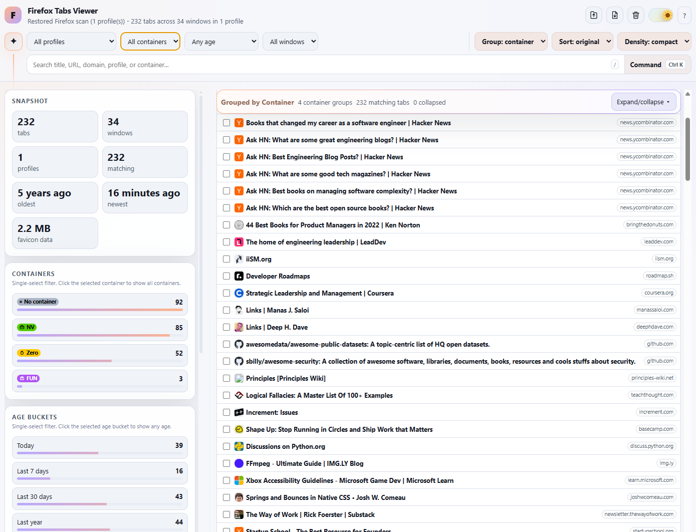
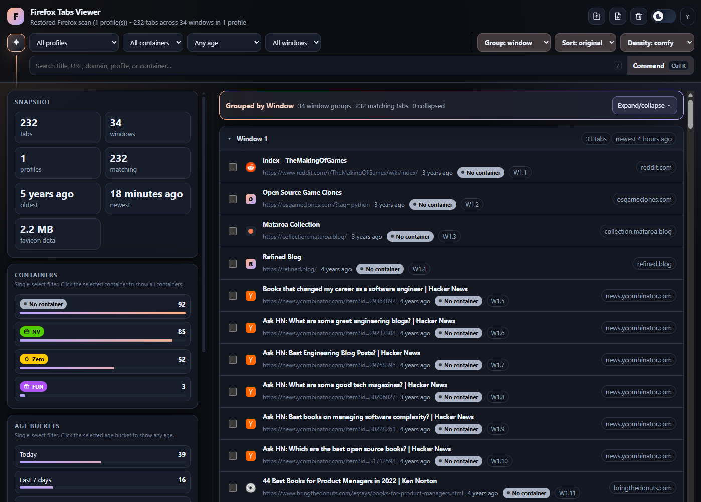
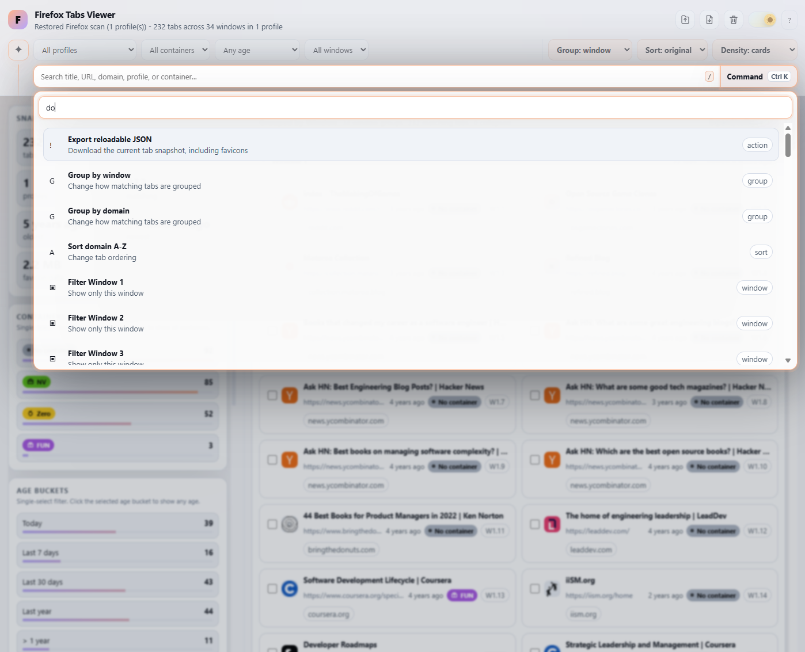
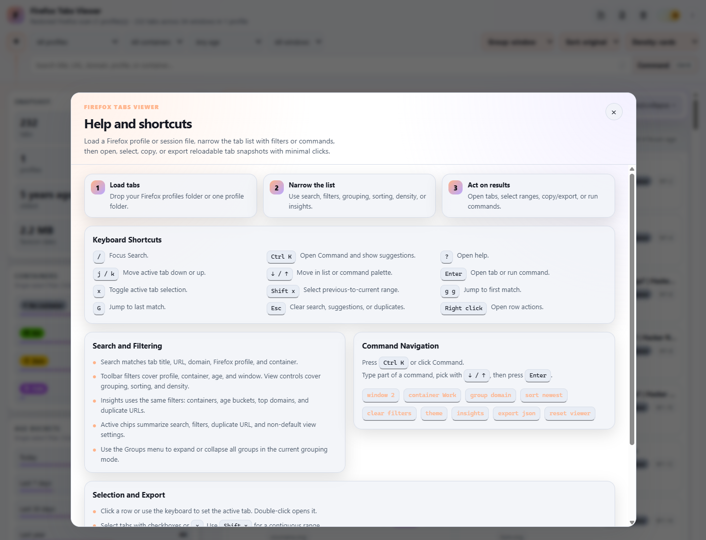

Firefox-tabs-review
----

`firefox-tabs-review` is a local, single-file viewer for a messy Firefox session.

Open `firefox-tabs-review.html`, drop in Firefox session data, and review the tabs outside the browser window that created them.

It does not talk to Firefox or close anything for you.  
It reads files you choose, builds a tab list, and leaves the decision-making to you.


<figure>
  
  <figcaption align="center">Light mode, compact rows, grouped by container. The sidebar shows the snapshot count, containers, age buckets, top domains, and duplicates.</figcaption>
</figure>

<br>
<br>

<figure>
  
  <figcaption align="center">Dark mode, grouped by window. Each row shows the title, URL, age, container, original window and tab position, and domain.</figcaption>
</figure>

<br>
<br>

<figure>
  
  <figcaption align="center">The command palette searches actions, grouping modes, sort modes, window filters, container filters, age filters, and tabs.</figcaption>
</figure>

<br>
<br>

<figure>
  
  <figcaption align="center">The help dialog lists the review flow, keyboard shortcuts, command examples, filtering notes, and selection/export actions.</figcaption>
</figure>

----

# What it is

The app is one static HTML file:

```text
firefox-tabs-review.html
```

There is no server, account, build step, browser extension, or Python script.

You can open the file from disk, or publish the same file as a static page.

The viewer accepts:

- a Firefox session file (`recovery.jsonlz4`, `previous.jsonlz4`, or `sessionstore.jsonlz4`).
- the session file plus the profile's `containers.json`, for container names, colors, and icons.
- a whole profile folder dropped from a Chromium-based browser (fallback; slow on large profiles).
- a JSON previously exported by this viewer.

The fast path is two files:

1. `<profile>/sessionstore-backups/recovery.jsonlz4` (falls back to `previous.jsonlz4` or `<profile>/sessionstore.jsonlz4`).
2. `<profile>/containers.json` (optional; only needed for container metadata).

Both can be dragged onto the page together, picked one at a time in the guided loader, or picked together with the fallback **Pick both Firefox files at once...** link.


## How it works

For each readable session entry, the viewer extracts:

- title
- URL
- last-accessed time
- favicon data URL, if Firefox stored one
- Firefox container id, name, color, and icon, when available
- Firefox profile name
- source session file
- window number and tab position

Favicons come from the session data. The viewer does not fetch favicons from the network.

## Saved state and exports

After a successful load, the viewer stores the last tab snapshot in this browser's `localStorage`, up to its built-in size limit. Refreshing the page can restore that last loaded review queue without reading the Firefox folder again.

`Export reloadable JSON` downloads a viewer-specific JSON file with the tabs and favicons. Drop that JSON back into the load dialog later to continue from the same snapshot.

Preferences such as theme, grouping, sorting, density, sidebar width, and sidebar visibility are stored locally in the browser. `Reset viewer` clears the current tab list and the saved snapshot for this app, but keeps your view preferences and chosen light/dark theme.

----

# How to use it

Open `firefox-tabs-review.html` in a browser, then drag `recovery.jsonlz4`
(and optionally `containers.json`) from your Firefox profile onto the page,
or use the guided picker in the load dialog. If the session uses containers,
the dialog asks for `containers.json` after the session file loads.

> Note: The load dialog includes platform-specific hints for the normal Firefox folder paths:
> 
> - Windows: `%APPDATA%\Mozilla\Firefox`
> - macOS: `~/Library/Application Support/Firefox`
> - Linux: `~/.mozilla/firefox`
>
> The profile folder is under `<that path>/Profiles/<profile>/`. `recovery.jsonlz4` lives inside its `sessionstore-backups/` subfolder; `containers.json` sits directly in the profile folder.

Start with the sidebar.  
Duplicates and top domains are usually the easiest cleanup.

Then switch grouping between window, container, domain, age, or even a flat list...  
...until the pile starts to make sense.

Use search for titles, URLs, domains, profile names, and container names.  
The toolbar filters by profile, container, age bucket, and window.  
Sorting covers original order, newest first, oldest first, title, and domain.

Select tabs with checkboxes or the keyboard,  
then use the bulk bar to open them, copy plain URLs, copy Markdown links, or copy OneTab-style text.

Right-click a row for one-tab actions: open, copy URL, copy title, copy Markdown, or filter by domain.

## Command palette (and shortcuts)

Press `Ctrl K` or click `Command` to open the command palette.  
It can run viewer actions, change grouping, change sort order, change density,  
toggle the theme, toggle the sidebar, export JSON, reset the viewer,  
filter by profile/container/window/age, and jump to a tab in the current results.

Useful shortcuts:

- `/` focuses search.
- `Ctrl K` opens the command palette.
- `?` opens help.
- `j` and `k` move the active row.
- Arrow keys move through rows or command results.
- `Enter` opens the active tab or runs the active command.
- `x` selects the active tab.
- `Shift x` selects a range.
- `g g` jumps to the first match.
- `G` jumps to the last match.
- `Esc` clears search, closes suggestions, or clears duplicate filtering.
- Right click opens row actions.

----

# A note on Privacy

The app runs in the browser:

- it reads files only after you select or drop them
- it does not upload session data
- it does not write inside your Firefox profile
- it does not start, stop, or signal Firefox

Firefox session data can include private URLs, page titles, internal links, local paths, and favicon data.  
Sharing the HTML viewer is fine. Sharing your own exported JSON or session files may expose browsing history.

----

# Known limits

- The viewer reads the current entry for each tab, not the whole back/forward history.
- Private windows are not captured because Firefox does not write them to session restore files.
- Pinned state, muted/audio state, reader mode, and scroll position are not shown.
- A session file can lag behind Firefox while the browser is still writing it.
